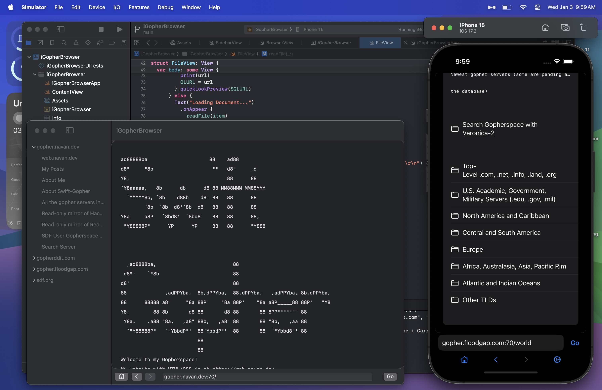

# iGopherBrowser

a modern gopher client

Lynx is an amazing gopher client for macOS, but when you are already using trying to build a client for iOS, why not make it for macOS too?

## Features

- [x] Browse gopher sites
- [x] Search gopher sites
- [x] Preview Media using QuickLook
- [x] Basic History 
- [ ] Bookmark gopher sites
- [ ] Download files
- [ ] ??? 

Uses [swift-gopher](https://github.com/navanchauhan/swift-gopher) for gopher protocol support.
