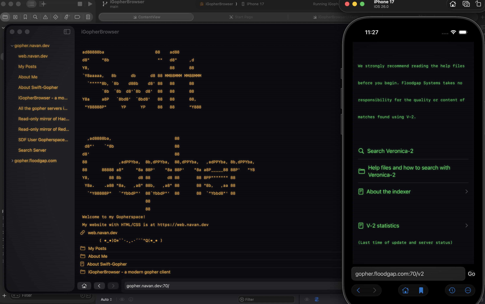
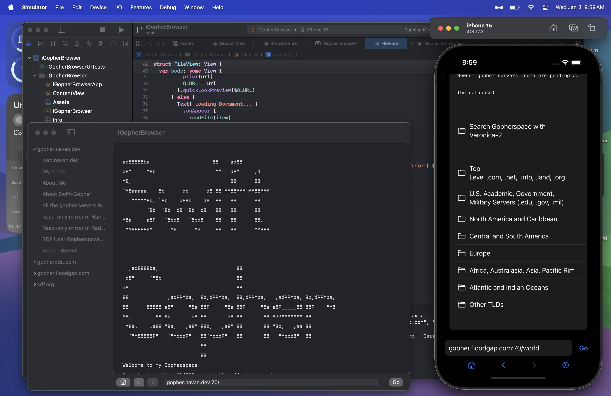

# iGopherBrowser

a modern gopher client

Now with Liquid Glass and **Retro** CRT Style!

Lynx is an amazing gopher client for macOS, but when you are already using trying to build a client for iOS, why not make it for macOS too?

## Features

- [x] Browse gopher sites
- [x] Search gopher sites
- [x] Preview Media using QuickLook
- [x] Basic History
- [x] Bookmark gopher sites
- [x] Download files* (I haven't tested all file formats)

Uses [swift-gopher](https://github.com/navanchauhan/swift-gopher) for gopher protocol support.

## Development

See [docs/testing.md](docs/testing.md) for unit, fixture UI, and opt-in live UI test commands.
